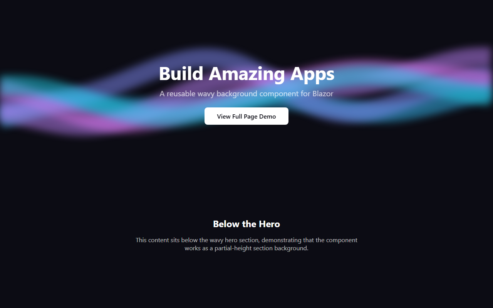
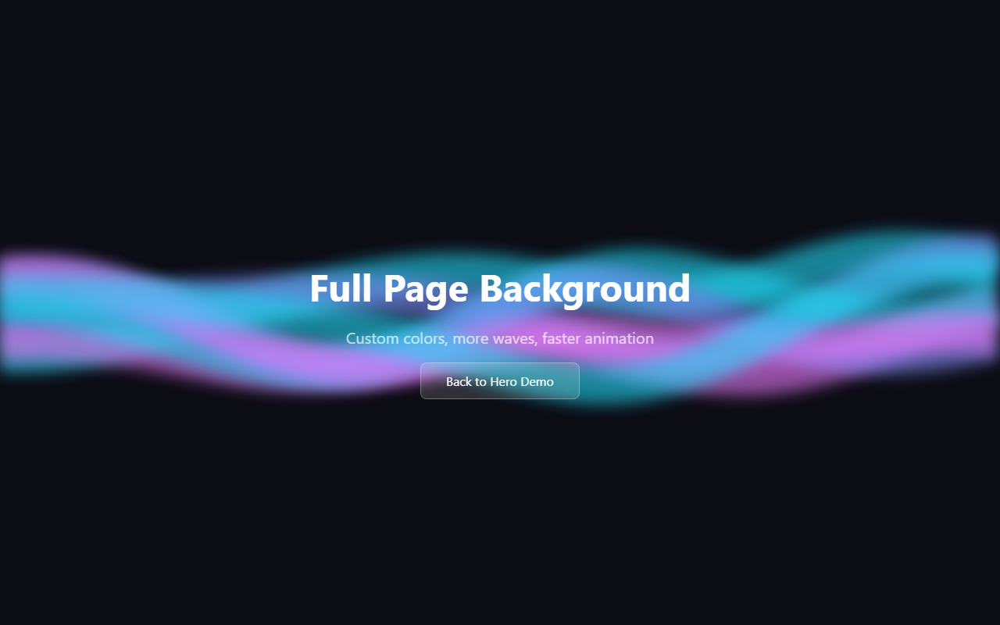
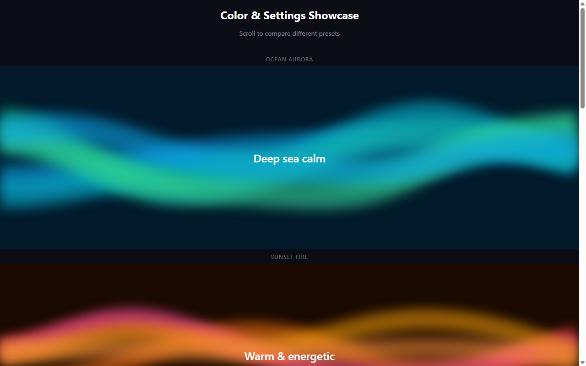

# HeroWave

[](https://github.com/cartsp/hero-wave/actions/workflows/ci.yml)
[](https://www.nuget.org/packages/HeroWave)
[](LICENSE)
[](https://cartsp.github.io/hero-wave/)

A reusable Blazor component for animated wavy background effects powered by HTML5 Canvas and simplex noise. Works as a hero section, full-page background, or any container background.

**[View Live Demo](https://cartsp.github.io/hero-wave/)** | [Hero Section](https://cartsp.github.io/hero-wave/) | [Full Page](https://cartsp.github.io/hero-wave/fullpage) | [Color Showcase](https://cartsp.github.io/hero-wave/showcase)







## Installation

```bash
dotnet add package HeroWave
```

Add the namespace to your `_Imports.razor`:

```razor
@using HeroWave.Components
```

## Quick Start

```razor
<WavyBackground Title="Hello World"
                Subtitle="Animated waves behind your content"
                Height="60vh">
    <button>Get Started</button>
</WavyBackground>
```

## Parameters

| Parameter | Type | Default | Description |
|-----------|------|---------|-------------|
| `Title` | `string?` | null | Large heading text centered over the waves |
| `Subtitle` | `string?` | null | Smaller text below the title |
| `ChildContent` | `RenderFragment?` | null | Custom Razor markup rendered below title/subtitle |
| `Height` | `string` | `"100vh"` | CSS height of the container |
| `Colors` | `string[]` | `["#38bdf8", "#818cf8", "#c084fc", "#e879f9", "#22d3ee"]` | Wave line colors |
| `BackgroundColor` | `string` | `"#0c0c14"` | Background fill color |
| `WaveCount` | `int` | `5` | Number of wave layers |
| `WaveWidth` | `int` | `50` | Stroke width of each wave (px) |
| `Speed` | `double` | `0.004` | Animation speed — time increment per frame (e.g. `0.004` slow, `0.008` fast) |
| `Opacity` | `double` | `0.5` | Wave opacity (0.0 - 1.0) |
| `TargetFps` | `int` | `60` | Target frames per second. Clamped to 1–120. Lower values reduce CPU/GPU usage. |
| `CssClass` | `string?` | null | Additional CSS class on the overlay |

> **Live update:** All visual parameters (`Colors`, `BackgroundColor`, `WaveCount`, `WaveWidth`, `Speed`, `Opacity`, `TargetFps`) can be changed at runtime without re-initialising the canvas. The component detects changes via a config hash and only calls the JS `update()` function when values actually change.

## Examples

### Hero Section

```razor
<WavyBackground Title="Build Amazing Apps"
                Subtitle="A reusable wavy background component for Blazor"
                Height="60vh">
    <a href="/signup" class="btn">Get Started</a>
</WavyBackground>
```

### Full Page Background

```razor
<WavyBackground Height="100vh"
                Speed="0.008"
                Colors="@(new[] { "#22d3ee", "#818cf8", "#e879f9" })"
                WaveCount="7"
                Opacity="0.6">
    <div class="my-layout">
        <nav>...</nav>
        <main>...</main>
    </div>
</WavyBackground>
```

### Color Presets

**Ocean Aurora** - cool blues and greens
```razor
<WavyBackground Colors="@(new[] { "#0ea5e9", "#06b6d4", "#14b8a6", "#10b981", "#34d399" })"
                BackgroundColor="#021a2b" WaveCount="6" WaveWidth="60" Opacity="0.6" />
```

**Sunset Fire** - warm oranges, reds, pinks
```razor
<WavyBackground Colors="@(new[] { "#f97316", "#ef4444", "#ec4899", "#f59e0b", "#fb923c" })"
                BackgroundColor="#1a0a00" Speed="0.008" Opacity="0.55" />
```

**Neon Cyberpunk** - electric, high contrast
```razor
<WavyBackground Colors="@(new[] { "#ff00ff", "#00ffff", "#39ff14", "#ff3131" })"
                BackgroundColor="#0a0a0a" WaveCount="4" WaveWidth="35" Speed="0.008" Opacity="0.7" />
```

**Minimal Frost** - white/silver on dark, subtle
```razor
<WavyBackground Colors="@(new[] { "#e2e8f0", "#94a3b8", "#cbd5e1", "#f1f5f9" })"
                BackgroundColor="#0f172a" WaveCount="3" WaveWidth="70" Opacity="0.3" />
```

**Northern Lights** - purples, greens, ethereal
```razor
<WavyBackground Colors="@(new[] { "#a855f7", "#6366f1", "#22d3ee", "#4ade80", "#818cf8" })"
                BackgroundColor="#0c0720" WaveCount="7" WaveWidth="55" />
```

**Molten Gold** - luxurious golds and ambers
```razor
<WavyBackground Colors="@(new[] { "#fbbf24", "#f59e0b", "#d97706", "#b45309", "#fcd34d" })"
                BackgroundColor="#1c1208" Speed="0.008" Opacity="0.45" />
```

## Performance

HeroWave includes several built-in optimisations:

| Feature | Description |
|---------|-------------|
| **FPS Throttling** | `TargetFps` parameter caps frame rate (default 60). Set lower to save CPU/GPU on less capable devices. |
| **Offscreen Pause** | `IntersectionObserver` pauses the animation loop when the canvas scrolls out of view. |
| **Debounced Resize** | Window resize events are debounced (100 ms) to avoid layout thrashing. |
| **Live Update** | Changing parameters at runtime calls `update()` instead of destroying and re-creating the canvas instance. |

## Contributing

```bash
# Clone and build
git clone https://github.com/cartsp/hero-wave.git
cd hero-wave
dotnet build

# Run the demo app
dotnet run --project demo/HeroWave.Demo

# Run unit tests
dotnet test tests/HeroWave.Tests/

# Run E2E tests (requires Playwright browsers installed)
dotnet test tests/HeroWave.E2E/
```

## License

[MIT](LICENSE)
